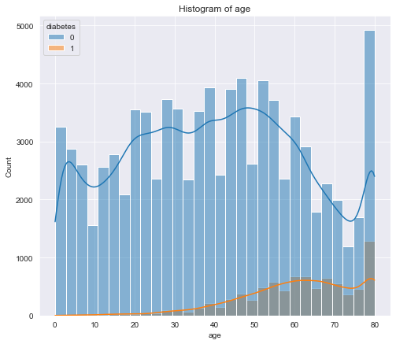
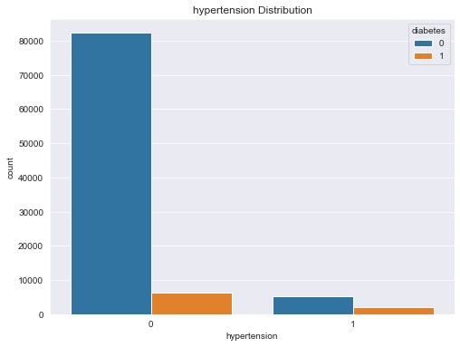
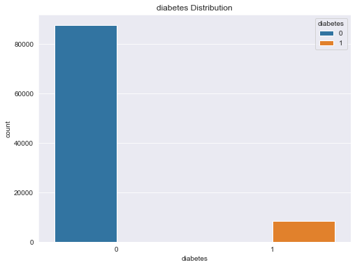
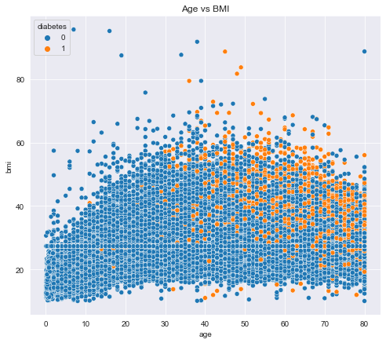
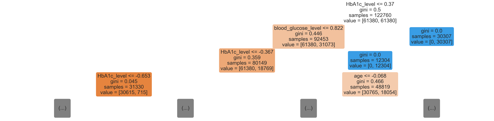
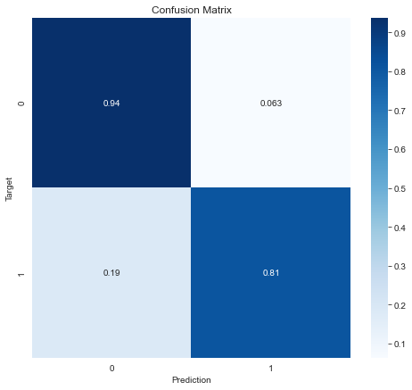

# Diabetes_Analysis_phase3

# Introduction

Diabetes is a disease that occurs when your blood glucose, also called blood sugar, is too high. Other factors such as gender, age, and bmi can also be contributors to the disease. This project will be focused in building models that can help predict whether a patient has the disease or not. This can be useful for healthcare professionals in identifying patients who may be at risk of developing diabetes and in developing personalized treatment plans. Additionally, the dataset can be used by researchers to explore the relationships between various medical and demographic factors and the likelihood of developing diabetes.

## Problem Statement

The head of medical Board has tasked me to create a predictive model that can predict whether a patient has diabetes or not.

To answer the question, I will build a classifier to predict whether patients have cancer with the given dataset.This will be based on several diagnostic measurements, including glucose level, blood pressure, smoking history, gender, BMI, and age. I will train models such as logistic regression, K Nearest Neighbours, decision trees and ensemble methods such as random forests and evaluate which model performs better.

## Objectives
My top objectives for modelling will be:

1. Determine important factors that affect diabetes.
2. Determine the best model to predict diabetes.
3. Create a model that predicts diabetes with an accuracy of 96% or above.

### Data sources
The data for this modelling was obtained from kaggle.

The dataset can be found by clicking the following link: <a href="https://www.kaggle.com/datasets/iammustafatz/diabetes-prediction-dataset" 
           target="_blank">Diabetes Dataset
        </a>

The data contains the following columns:

1. Age: This is the age of all patients diagnosed.

2. Gender: The gender colum displays whether one is male or female.

3. Bmi: This is the body mass index of all patients which is a measure of body fat based on a person's height and weight.

4. Hypertension: This column displays whether the patient has high blood pressure or not.

5. Heart disease: This column displays whether the patient has heart disease or not.

6. Smoking history: This column shows the history of the patient regarding smoking.

7. HbA1c Level: HbA1c (glycated hemoglobin) is a measure of the average blood glucose level over the past 2-3 months.

8. Blood Glucose Level: Blood glucose level refers to the amount of glucose (sugar) present in the blood at a given time.

## Data Understanding

Key Questions for Data Understanding:

- What is the shape of the dataset.

- Are there missing values in the dataset.

- What are the datatypes of the columns.

- Are there duplicates in the dataset.

## Analysis and Modelling

The analysis includes several statistical analysis and visualization techniques to uncover insights:

- Univariate Analysis: Examining the distribution of single variables, such as age and bmi, through histograms and count plots for hypertension, heart disease, smoking history and the diabetes column.

- Multivariate Analysis: A scatterplot of age vs bmi with hue as the diabetes column.

- Correlation Analysis: Exploring relationships between numeric variables to understand associations and check for multicollinearity

**Fitting of classification models**

Models such as logistic regression, decision trees and random forests are fit and the evaluation of the models done to choose the best model.

## Visualizations
The following visualizations are included in this analysis:

Histogram of age

Count plot of hypertension

Count plot of the diabetes column

Scatterplot of age vs bmi

Decision tree image with max depth of 3

Confusion matrix of random forest

## Conclusions

- The analysis employed a **random forest classifier** as the best model to predict diabetes based on various health indicators and lifestyle factors. The model was trained and evaluated on a dataset of 100,000 records, and hyperparameter tuning was performed to optimize the model's performance.

- The model achieved an **accuracy** of approximately 92%, with **precision** of 0.98 for class 0 (non-diabetic) and 0.55 for class 1 (diabetic). It was also able to **recall** 93% of non-diabetic cases and 81% of diabetic cases correctly. The relatively high accuracy and balanced performance on both classes indicate that the model is well-tuned and robust.

- **Feature importance analysis** highlighted HbA1c_level and blood_glucose_level as the most critical factors in predicting Diabetes. Age and BMI also showed significant importance. However, some features such as gender, had minimal or no impact on the model's predictions.

## Recommendations

- Despite the model achieving a good accuracy of 92%, more data should be collected for patients with diabetes.

- The model can be used to help detect early signs of the disease making it easiear to take measures early on.

## Suggestions for future improvement

- Collection of more data on things such as family history, physical activity level and diet information could help improve the model's predictive accuracy.

- Training could be done on other machine learning models. This can help in improving the accuracy of predictions.

- Feature engineering such as interaction terms and polynomial features could help improve the model's performance.